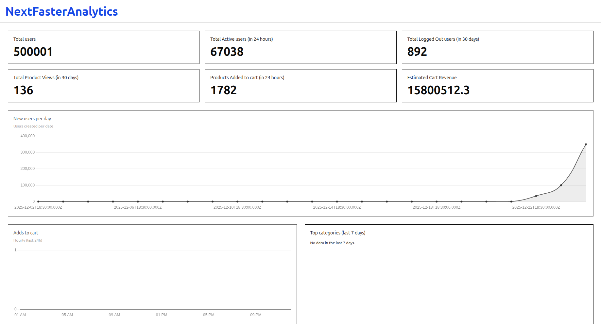
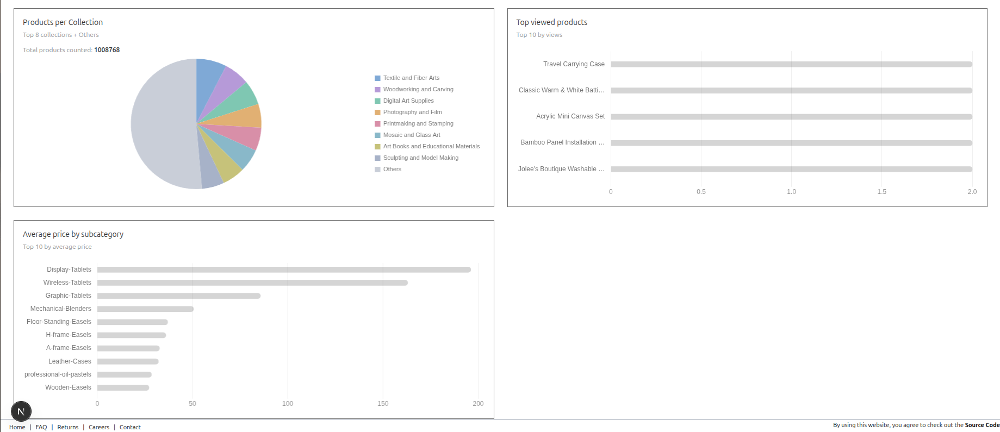

# NextFaster Analytics

A simple internal analytics dashboard for **NextFaster**.  
Built with **Next.js (App Router)**, **TailwindCSS**, and **PostgreSQL**.

## Features

- Dashboard-style UI (simple, minimal styling)
- Total users count
- Active users (last 24 hours) based on `last_login_at`
- Logged-out users (last 24 hours) based on `last_logout_at`
- Data fetched server-side using Postgres queries
- Cart additions tracking via `cart_metrics`
- Product view events per session via `product_view_events`
- Estimated cart revenue
- Products per collection
- Products added to cart

## Tech Stack


## Caching Strategy

This project uses **`unstable_cache`** from Next.js to optimize database query performance:

### Why `unstable_cache`?

- **Performance**: Caches expensive database queries to reduce response times
- **Deduplication**: Wrapped with React's `cache()` to prevent duplicate requests during a single render
- **Automatic Revalidation**: Configured with time-based revalidation to keep data fresh
- **Server-Side**: Works seamlessly with Next.js App Router's server components

The custom wrapper in `lib/unstable-cache.ts` combines Next.js's `unstable_cache` with React's `cache` to provide both request-level deduplication and time-based cache revalidation, ensuring optimal performance without sacrificing data freshness.

## Getting Started

### 1) Install dependencies
```bash
npm install
# or pnpm install
# or yarn
```

### 22) Configure environment variables

Create a .env.local file in the project root:

```bash
POSTGRES_USER=your_user
POSTGRES_HOST=localhost
POSTGRES_DB=your_db
POSTGRES_PASSWORD=your_password
POSTGRES_PORT=5432
POSTGRES_MAX=10
POSTGRES_IDLE_TIMEOUT=30000
POSTGRES_CONNECTION_TIMEOUT=5000
POSTGRES_KEEP_ALIVE=true
```

### 4) Run the server

```bash 
pnpm dev
```

### 3) Database Setup

All the required SQL commands are provided in the `data/` folder:

1. Navigate to the `data/` folder and unzip `data.zip`:
   ```bash
   cd data
   unzip data.zip
   ```

2. Run the SQL file in PostgreSQL:
   ```bash
   psql -U your_user -d your_db
   ```
   
   Then inside the psql prompt:
   ```sql
   \i data.sql
   ```

This will create all the required tables and populate them with sample data.

## Screenshots

### Analytics Dashboard





## Credits

Based on **NextFaster** by:
- [@ethanniser](https://x.com/ethanniser)
- [@RhysSullivan](https://x.com/RhysSullivan)
- [@armans-code](https://x.com/ksw_arman)

